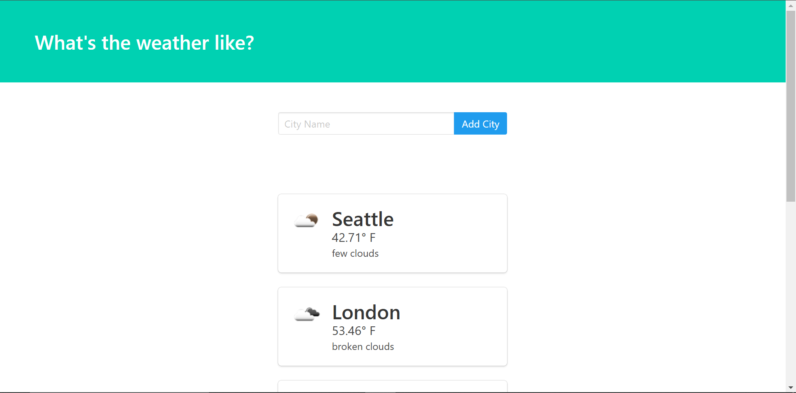

# Basic Guide

This is a simple web app built using Flask that allows users to view real-time weather conditions for cities across the world. The application leverages OpenWeatherMap API

## Tools used

1. HTML
2. Python
3. Flask
4. bulma.css
5. PostgreSQL

## [packages]

1. flask-cors = "*"
2. flask-sqlalchemy = "*"
3. requests = "*"
4. psycopg2 = "*"

